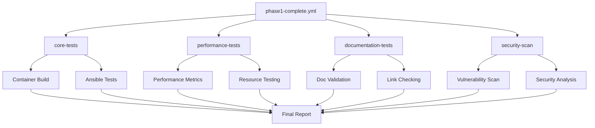

# GitHub Actions Workflows - Phase 1 Testing Suite

This directory contains a comprehensive set of GitHub Actions workflows designed to validate and test the Phase 1 implementation of the Ansible Docker project.

## 🔄 Workflows Overview

### Core Workflows

#### `phase1-tests.yml` - Primary Validation Suite
**Triggers:** Push/PR to main/develop, manual dispatch
**Purpose:** Complete validation of Phase 1 functionality

**Test Categories:**
- ✅ **Structure Validation** - File structure, permissions, YAML syntax
- 🛡️ **Security Analysis** - Dockerfile linting, vulnerability scanning
- 🏗️ **Build & Test** - Container build, Ansible installation, user config
- 🔗 **Integration Tests** - Networking, volumes, SSH, environment variables
- 📊 **Test Reporting** - Comprehensive results summary

#### `phase1-performance.yml` - Performance Testing
**Triggers:** Push/PR, manual dispatch with options
**Purpose:** Container performance validation

**Performance Metrics:**
- ⏱️ **Boot Time** - Container startup performance (< 60s target)
- 🧠 **Memory Usage** - RAM consumption monitoring (< 500MB idle)
- 🖥️ **CPU Usage** - Processing efficiency monitoring
- 🎭 **Ansible Performance** - Command execution speed
- 📜 **Script Performance** - Health checks and automation scripts
- 💪 **Stress Testing** - Optional extended load testing
- 📊 **Resource Limits** - Testing with constrained resources

#### `phase1-documentation.yml` - Documentation Validation
**Triggers:** Push/PR affecting docs, manual dispatch
**Purpose:** Documentation quality and completeness

**Documentation Checks:**
- 📚 **Structure Validation** - README sections and organization
- 🔗 **Link Validation** - Internal and external link checking
- 💻 **Code Examples** - Validation of command examples
- 🔧 **Technical Docs** - Architecture and reference documentation
- 📋 **Completeness** - Coverage of scripts and playbooks
- 🌍 **Environment Docs** - Variables and configuration documentation
- ✅ **Markdown Linting** - Syntax and style consistency
- 📦 **Version Information** - Version 1.3.0 consistency

#### `security-scan.yml` - Security Vulnerability Scanning
**Triggers:** Push/PR affecting Dockerfile, weekly schedule, manual dispatch
**Purpose:** Container security assessment

**Security Tools:**
- 🔍 **Trivy** - Comprehensive vulnerability scanning
- 🛡️ **Grype** - Vulnerability detection and assessment
- 🐳 **Docker Scout** - Docker-specific security analysis
- 📋 **Security Reporting** - Consolidated security status

#### `phase1-complete.yml` - Master Validation Workflow
**Triggers:** Push to main, PR to main, manual dispatch with options
**Purpose:** Comprehensive Phase 1 validation orchestration

**Workflow Features:**
- 🔍 **Pre-validation** - Change detection and readiness checks
- 🏗️ **Core Tests** - Essential functionality validation
- 📊 **Performance Tests** - Optional performance validation
- 📚 **Documentation Tests** - Documentation quality checks
- 🛡️ **Security Scans** - Optional security validation
- 📈 **Final Analysis** - Comprehensive reporting
- 🚀 **Deployment Readiness** - Production readiness assessment
- 🏷️ **Release Management** - Automated release draft creation

### Support Workflows

#### `build-tests.yml` - Basic Build Validation
**Purpose:** Quick build verification for development

#### `integration-tests.yml` - Extended Integration Testing
**Purpose:** Comprehensive integration testing with multiple scenarios

#### `ci-cd.yml` - Continuous Integration/Deployment
**Purpose:** Main CI/CD pipeline coordination

## 🚀 Usage Guide

### Automatic Triggers

All workflows are triggered automatically on relevant changes:

```bash
# Triggers most workflows
git push origin main

# Triggers specific workflows
git push origin develop  # Development workflows
```

### Manual Execution

Execute workflows manually via GitHub Actions UI or GitHub CLI:

```bash
# Run complete validation suite
gh workflow run phase1-complete.yml

# Run performance tests with custom duration
gh workflow run phase1-performance.yml -f stress_duration=10

# Run security scan
gh workflow run security-scan.yml
```

### Local Validation with Python

The recommended way to validate locally is using the Python script:

```bash
# Basic validation
python validate_phase1.py

# Skip performance tests (faster)
python validate_phase1.py --skip-performance

# Verbose output for debugging
python validate_phase1.py --verbose

# Specify docker-compose command explicitly
python validate_phase1.py --docker-compose "docker compose"

# Install optional dependencies for enhanced features
pip install -r requirements-validation.txt
```

**Features of the Python script:**
- ✅ **Cross-platform** - Works on Windows, Linux, and macOS
- ✅ **Auto-detection** - Automatically detects docker-compose command
- ✅ **Colored output** - Enhanced readability with color coding
- ✅ **Comprehensive testing** - Same validation as GitHub Actions
- ✅ **Error handling** - Detailed error messages and debugging info
- ✅ **Performance testing** - Optional container performance validation
- ✅ **Cleanup automation** - Automatic cleanup of test resources

### Local Validation

Before pushing, run local validation:

```bash
# Python script (recommended - cross-platform)
python validate_phase1.py

# With options
python validate_phase1.py --skip-performance --verbose

# Install optional dependencies for enhanced features
pip install -r requirements-validation.txt
```

## 📊 Test Results & Artifacts

### Artifacts Generated

Each workflow generates specific artifacts:

- **Test Reports** - Detailed test results and analysis
- **Performance Reports** - Performance metrics and recommendations
- **Security Reports** - Vulnerability assessments
- **Documentation Reports** - Documentation quality analysis
- **Build Logs** - Container build and test logs

### Viewing Results

1. **GitHub Actions UI** - View workflow runs and results
2. **Pull Request Checks** - Automated status checks on PRs
3. **Artifacts Download** - Download detailed reports
4. **Issues Creation** - Automatic issue creation on failures

## 🔧 Configuration

### Workflow Configuration Files

- `.yamllint` - YAML linting rules
- `.hadolint.yaml` - Dockerfile linting configuration
- `docker-compose.yml` - Container orchestration

### Environment Variables

```yaml
env:
  DOCKER_BUILDKIT: 1
  COMPOSE_DOCKER_CLI_BUILD: 1
```

### Workflow Inputs

#### `phase1-complete.yml` Inputs:
- `run_performance_tests` (boolean) - Enable performance testing
- `run_security_scan` (boolean) - Enable security scanning
- `stress_test_duration` (choice) - Stress test duration in minutes

#### `phase1-performance.yml` Inputs:
- `stress_duration` (choice) - Stress test duration (2, 5, 10 minutes)

## 📋 Test Matrix

| Test Category | Workflow | Frequency | Duration |
|---------------|----------|-----------|----------|
| Structure | phase1-tests.yml | Every push | ~5 min |
| Security | security-scan.yml | Weekly + changes | ~10 min |
| Performance | phase1-performance.yml | On-demand | ~15 min |
| Documentation | phase1-documentation.yml | Doc changes | ~3 min |
| Complete | phase1-complete.yml | Main branch | ~20 min |

## 🛠️ Prerequisites & Setup

### System Requirements
- **Docker Desktop** (Windows/Mac) or **Docker Engine** (Linux)
- **Docker Compose** v2.x or docker-compose v1.29+
- **Python 3.7+** (for local validation script)
- **Git**

### Optional Tools for Enhanced Experience
```bash
# Install Python dependencies for enhanced local validation
pip install -r requirements-validation.txt

# Install YAML linting (optional)
pip install yamllint

# Install Dockerfile linting (optional)
# Download hadolint from: https://github.com/hadolint/hadolint
```

### Quick Setup
```bash
# Clone repository
git clone <your-repo-url>
cd ansible_docker

# Verify Docker setup
docker info
docker compose version

# Run local validation
python validate_phase1.py

# If validation passes, you're ready to develop!
```

## 🛠️ Troubleshooting

### Common Issues

#### Build Failures
```bash
# Check Docker environment
docker info
docker compose version

# Verify file structure
ls -la ansible-control/  # Linux/Mac
dir ansible-control\    # Windows

# Run local validation
python validate_phase1.py --verbose
```

#### Test Timeouts
- Increase timeout values in workflow files
- Check container resource requirements
- Verify network connectivity

#### Permission Issues
```bash
# Fix script permissions (Linux/Mac)
chmod +x ansible-control/scripts/*.sh

# Python script handles permissions automatically
python validate_phase1.py
```

#### Python Script Issues
```bash
# Install optional dependencies
pip install -r requirements-validation.txt

# Check Python version (requires 3.7+)
python --version

# Run with verbose output for debugging
python validate_phase1.py --verbose

# Skip performance tests if having issues
python validate_phase1.py --skip-performance
```

### Debugging Workflows

1. **Enable Debug Logging**
   ```yaml
   env:
     ACTIONS_STEP_DEBUG: true
     ACTIONS_RUNNER_DEBUG: true
   ```

2. **Use Workflow Dispatch** - Test specific scenarios manually

3. **Check Artifacts** - Download and review generated reports

## 📈 Monitoring & Maintenance

### Weekly Tasks
- ✅ Review security scan results
- ✅ Check performance trends
- ✅ Update dependencies if needed
- ✅ Review and address workflow warnings

### Monthly Tasks
- ✅ Review and update test coverage
- ✅ Optimize workflow performance
- ✅ Update GitHub Actions versions
- ✅ Review security policies

### Release Tasks
- ✅ Run complete validation suite
- ✅ Generate comprehensive test report
- ✅ Update documentation
- ✅ Tag release version

## 🔄 Workflow Dependencies



## 📚 Best Practices

### Workflow Development
- ✅ Use specific action versions (not `@main`)
- ✅ Include proper error handling
- ✅ Generate artifacts for debugging
- ✅ Implement proper cleanup procedures

### Test Development
- ✅ Make tests idempotent
- ✅ Include comprehensive error messages
- ✅ Test both success and failure scenarios
- ✅ Document test requirements

### Security
- ✅ Use least privilege principles
- ✅ Scan for vulnerabilities regularly
- ✅ Keep secrets secure
- ✅ Review third-party actions

## 🚀 Next Steps (Phase 2)

These workflows are designed to support Phase 2 development:

1. **Extend Test Coverage** - Add managed node testing
2. **Multi-Container Testing** - Test container orchestration
3. **End-to-End Testing** - Complete Ansible automation testing
4. **Production Deployment** - Add deployment workflows
5. **Monitoring Integration** - Add observability testing

---

**Note:** These workflows ensure that Phase 1 meets production-ready standards and provides a solid foundation for Phase 2 development.
